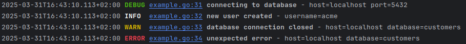

# Golang slog handler

A slog handler that adds formatting options and removes some unnecessary allocations from the standard slog text handler.



## Usage

See [examples/example.go](examples/example.go)

## Options

Options is set in the struct `HandlerOptions` when creating the slog handler.

### AddSource 

AddSource causes the handler to compute the source code position
of the log statement and add a SourceKey attribute to the output.

This option is copied from golang [slog.HandlerOptions](https://github.com/golang/go/blob/master/src/log/slog/handler.go).

**Enabling this option causes the logger to do two memory allocations for each log call.**

### AddSourceFullPath

Write full file path of source file instead of just the file name.
Enabling this option automatically sets AddSource to true.

### Level

The minimum record level that will be logged.  The handler discards records with lower levels. 
If Level is nil, the handler assumes slog.LevelInfo. The handler calls Level.Level for each record processed;
to adjust the minimum level dynamically, use a LevelVar.

This option is copied from golang [slog.HandlerOptions](https://github.com/golang/go/blob/master/src/log/slog/handler.go).

### BoldMessage

Write the message part of the log row in bold.

### ColorSeverity

Write severity with ansi colors.

### Date

Date Prepend the date to the log row time for a complete RFC3339 date-time with milliseconds.

## Memory allocations

Two memory allocations happen each logging call, when enabling the option AddSource or AddSourceFullPath.

## Installation

```shell
go get github.com/utvecklat/slogformat
```

## License and Code of Conduct

This package is released under the [MIT License](LICENSE).
Please follow the [code of conduct](CODE_OF_CONDUCT.md) when you interact with the project contributors.

This package also includes code from [The Go Programming Language](https://github.com/golang/go/) released under
[BSD 3-Clause licence](https://github.com/golang/go/blob/master/LICENSE).

## References 

This slog handler was written using the following guide.

https://github.com/golang/example/blob/master/slog-handler-guide/README.md

The handler options AddSource, Level and their comments, is copied from the slog package, handler.go file.
[https://github.com/golang/go/blob/master/src/log/slog/handler.go](https://github.com/golang/go/blob/master/src/log/slog/handler.go)

[internal/buffer/buffer.go](internal/buffer/buffer.go) is sourced from 
[https://github.com/golang/go/blob/master/src/log/slog/internal/buffer/buffer.go](https://github.com/golang/go/blob/master/src/log/slog/internal/buffer/buffer.go)